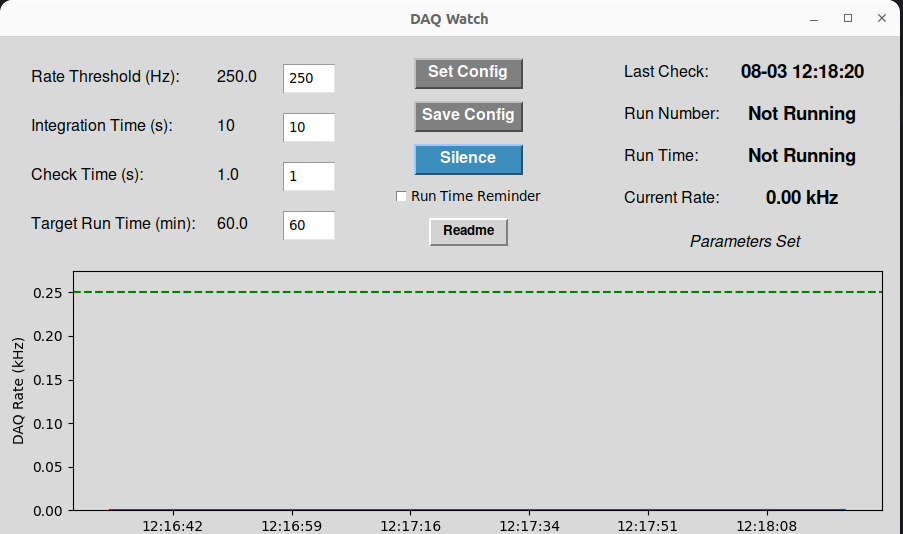

# sPHENIX_DAQ_Watch

## Overview

`sPHENIX_DAQ_Watch` is a script designed to monitor the DAQ (Data Acquisition) rate for the sPHENIX experiment. It interacts with a Prometheus database via a Grafana proxy API call to continuously check the DAQ rate. If the rate falls below a specified threshold, the application triggers an audible alarm. This is useful for quickly alerting the shift crew to potential issues such as system hangs or beam aborts.



## Features

- Monitors DAQ rate and alerts shift crew when rate falls below set threshold.
- Easy to silence/close if not wanted.
- Most relevant parameters can be set by the user.
- Parameter configurations can be saved and loaded when GUI reopned.
- Can also make audible alert when run duration has reached a set time. Theoretically convenient when things are going very well.

## Parameters

- **Rate Threshold (Hz):** The alarm will sound if the DAQ rate falls below this value.
- **Integration Time (s):** The period over which the DAQ rate is averaged. Increasing this value can reduce false alarms.
- **Check Time (s):** The interval between each database poll.
- **Target Run Time (min):** The maximum duration for each run. This setting is used only if the 'Run Time Reminder' is enabled.
- **Run Time Reminder:** Option to alert when the target run time is reached, reminding the user to start a new run.

## Buttons

- **Set:** Apply the input parameters.
- **Save Config:** Save the current configuration to a file. The values will be reloaded the next time the GUI starts.
- **Silence/Unsilence:** Mute or unmute the alarm.

## Status Parameters and Plot

- **Last Check:** Displays the timestamp of the last database poll.
- **Run Number:** Shows the current run number.
- **Run Time:** Indicates the elapsed time for the current run. This starts counting once the GUI is opened.
- **Current Rate:** Displays the current DAQ rate.
- **Rate Plot:** A graph showing the DAQ rate over time, updated with each check.

## System Requirements

- The application is currently compatible with Linux systems that have the `aplay` command available.
- python >= 3.8 necessary with matplotlib and requests packages

## Running the Application

To run the `sPHENIX_DAQ_Watch` application from the data monitor terminal, run:
```sh
~/anaconda3/bin/python ~/dylan/sPHENIX_DAQ_Watch/main.py
```

With the proper packages it may also be possible to run from external Linux machines. First perform an ssh port forward as described [here](https://wiki.sphenix.bnl.gov/index.php/Operation_Analytics_Site_(Grafana)). Next, clone this repository and run it in local mode:
```sh
git clone https://github.com/Dyn0402/sPHENIX_DAQ_Watch.git
cd sPHENIX_DAQ_WATCH
python main.py local
```

## Contact

For questions or issues, please contact Dylan Neff at [dneff@ucla.edu](mailto:dneff@ucla.edu).
